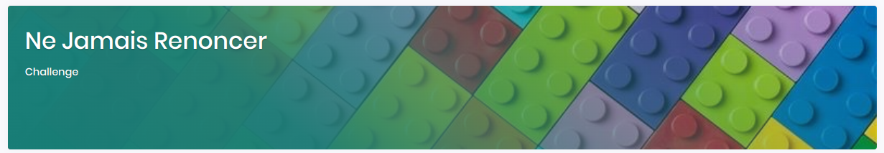
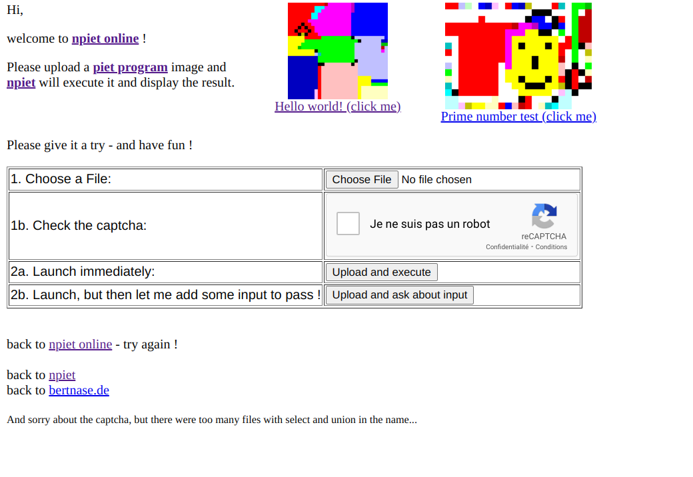
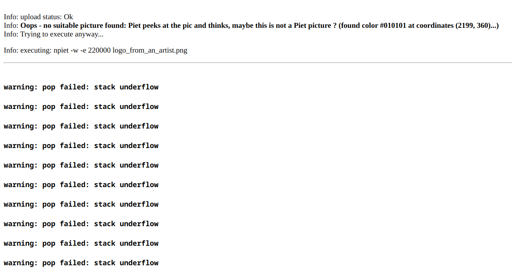
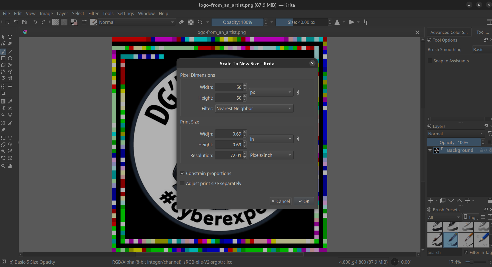
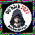
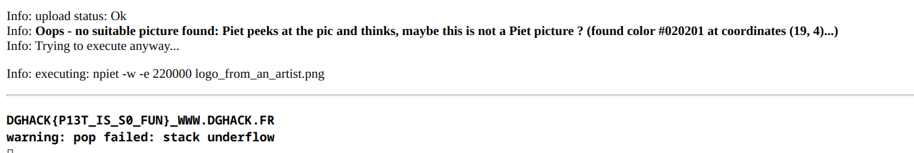

## Ne jamais renoncer (50 points)

### Enoncé


> Le logo officiel du DG'hAck a été repris par un artiste de talent, mais pourquoi ?


Le fichier joint est ```logo-from_an_artist.png```

<p align="center">
    
</p>

### Résolution

Le tour de l'image m'a fait penser directement au challenge de root-me <https://www.root-me.org/fr/Challenges/Steganographie/Crypt-art>

Il s'agit du langage ésotérique **piet**. Un site internet permet de charger en ligne une image, d'exécuter le code caché et d'afficher le résulat : <http://www.bertnase.de/npiet/npiet-execute.php>

<p align="center">
    
</p>

Cependant, quand on charge l'image et qu'on exécute le code, on obtient une erreur : 

<p align="center">
    
</p>

Afin de simplifier le débogage, on peut tout d'abord essayer de changer la taille de l'image afin que chaque codel ne soit qu'un seul pixel. 

Etant donné qu'on a 50 codels en largeur et en hauteur, on cherche donc à avoir une image carrée de 50 pixels de côté. Pour cela, j'ai utilisé un logiciel de traitement d'image open source appelé *Krita*

<p align="center">
    
</p>

Il faut faire attention à prendre comme filtre *Nearest Neighbor* et non le filtre par défaut, car les couleurs ne seraient alors plus valides (au sein d'un codel, les couleurs sont toutes identiques, donc *Nearest Neighbor* renvoie la bonne couleur). 

Voici l'image obtenue :

<p align="center">
    
</p>

Ensuite, on essaie d'uploader cette image sur le site *npiet* et on obtient le flag ! 

<p align="center">
    
</p>


