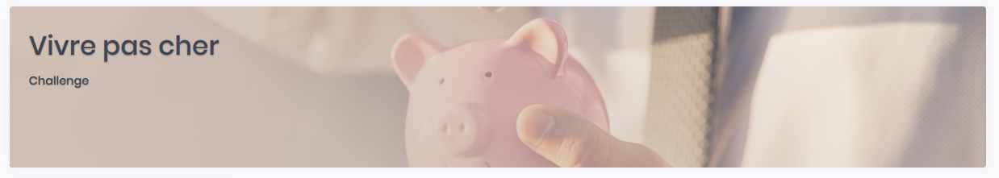
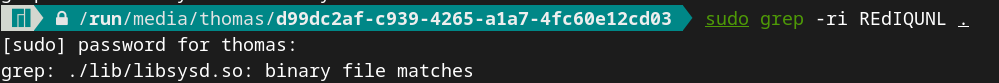
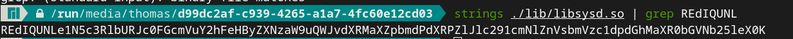
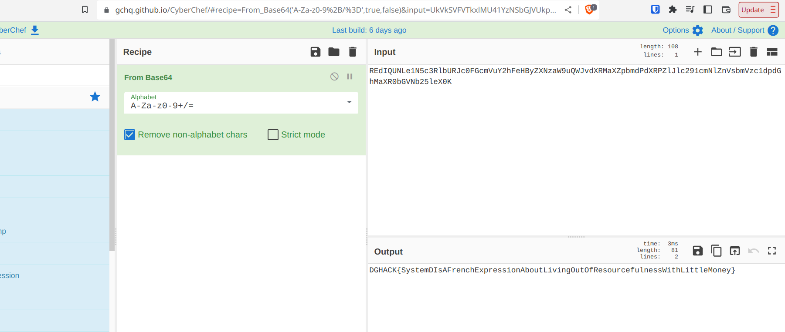

## Vivre pas cher (50 points)

### Enoncé

On a une image disque ```cheap-life.img``` de 1.07 Gb. 

Enoncé : 

>Notre serveur a été piraté. C'est une évidence.
>Ils dévoilent notre code source sans arrêt, dès que nous le mettons à jour.
>Vous devez trouver l'origine de cette backdoor dès que possible.
>Annie Massion, Services postaux


### Résolution

Après avoir regardé le type de partition, on peut commencer par la monter avec 
    ```sudo losetup -P -f --show cheap-life.img ```


Une fois monté, le premier reflexe à avoir dans ce type de CTF où on connait une partie du flag (tous les flags commencent par *DGHACK*) est de faire un *grep* de cette partie connue. Cela ne donne rien, on essaie alors en *Base64*


<p align="center">
    
</p>

Cette chaine de caractère est donc présente dans ce fichier. On affiche alors la chaine entière

<p align="center">
    
</p>

Cette chaine ressemble beaucoup au flag en base64. On la copie-colle sur Cyberchef 


<p align="center">
    
</p>

On obtient le Flag **DGHACK{SystemDIsAFrenchExpressionAboutLivingOutOfResourcefulnessWithLittleMoney}** 

## Remarque

Cette manière de résoudre le challenge n'est bien sûre pas celle attendue car c'est un challenge à 100 points, mais elle a le mérite d'être la plus rapide et efficace. C'est une bonne pratique de rechercher systématiquement la partie connue du flag en différents encodages pour les challenges de forensics. 


