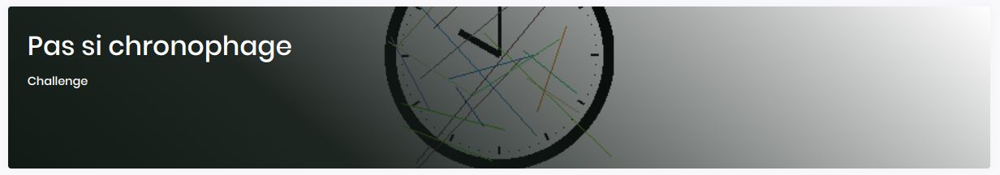
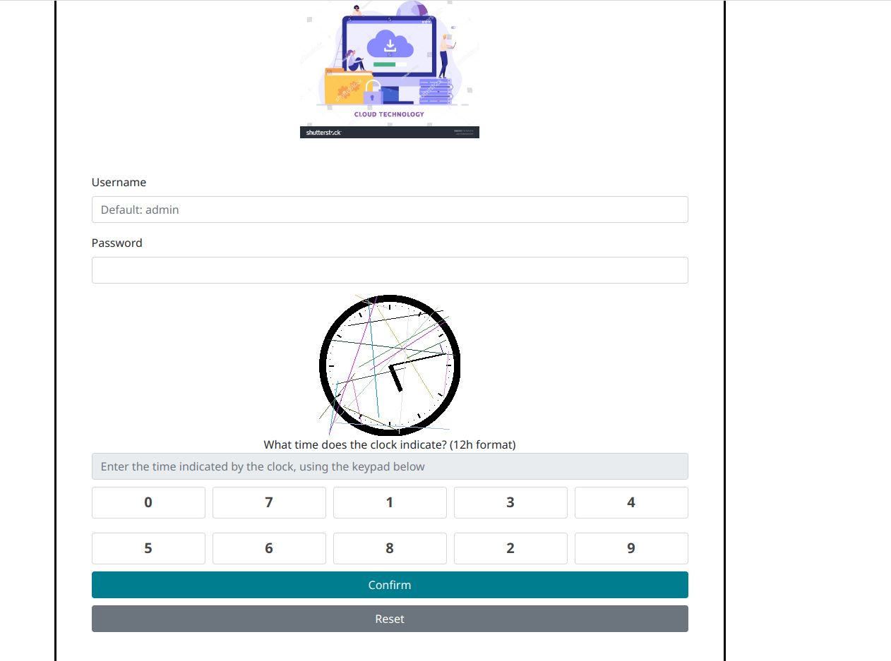
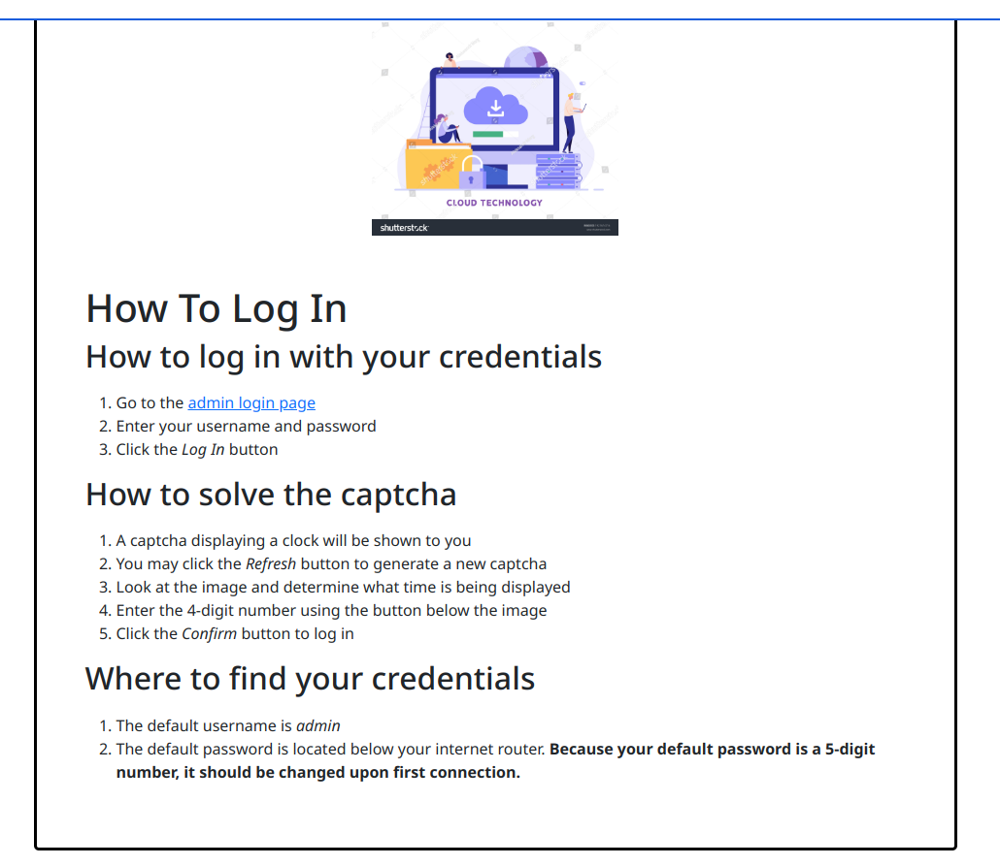
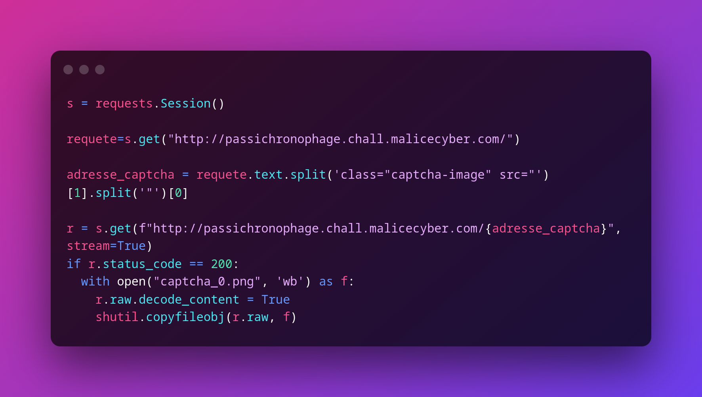
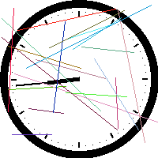
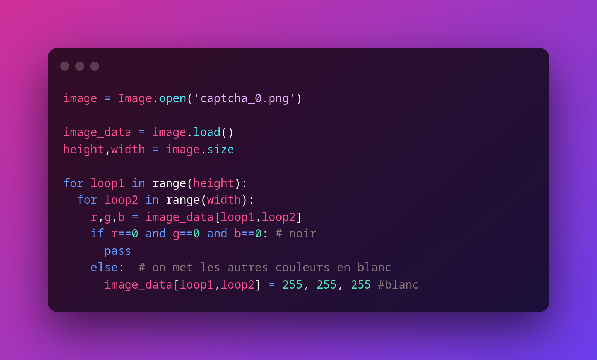
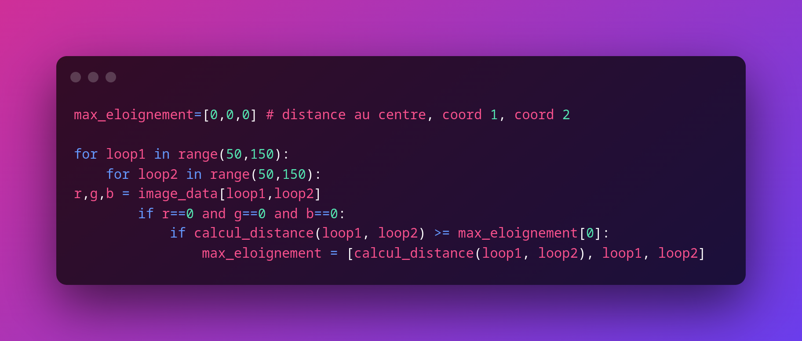

## Pas si chronophage (dev / 100 points)


Enoncé 

> Cette application permet la connexion de l'utilisateur à son compte de box internet. 

On a un lien du site suivant : 


<p align="center">
    
</p>

## Résolution

Tout d'abord, on teste le site et son capcha. On obtient une erreur qui nous permet d'obtenir les explications suivantes : 

<p align="center">
    
</p>


L'énoncé est alors clair : il faut résoudre le captcha pour tous les mots de passes de 5 caractères, soit 100 000 tentatives ! 

Il faut donc chercher à automatiser la lecture de l'horloge. Il faut donc réussir à lire à la fois l'heure et les minutes sur le captcha. La solution proposée est en python et se trouve dans le fichier ```solution.py```

### 1. Traitement initial de l'image
 
Tout d'abord, il faut télécharger le capcha et l'enregistrer sur sa machine, pour cela, on utilise la bibliothèque *requests* de python

<p align="center">
    
</p>

Il fauyt ensuite commencer à traiter l'image obtenue. En regardant en détail le captcha, on voit qu'il est préférable de nettoyer l'image des lignes de couleurs avant de calculer les heures.

<p align="center">
    
</p>

Pour cela, on convertit toutes les couleurs de l'image qui ne sont pas du noir en blanc

<p align="center">
    
</p>


### 2. Calcul des minutes

Pour le calcul des minutes, on se place dans un carré centrée allant des pixels 50 à 150 de côté, puis on regarde quel est le pixel le plus éloigné du centre grâce à la fonction *calcul_eloignement* (cf code en annexe)

<p align="center">
    
</p>

Une fois la position du pixel le plus loin connu, il est facile de déterminer l'angle avec la vertical (trigonométrie) puis d'en déterminer la minute correspondante. 

### 3. Calcul de l'heure

Le calcul des heures est plus compliqué que celui des minutes, car l'aiguille est plus petite. Si on calcule l'angle avec la verticale de la même manière, notre résultat sera faussé par l'aiguille des minutes. 

Pour résoudre ce problème, il faut utiliser le fait que l'aiguille des heures est plus large que celle des minutes. On crée une fonction *determination_alignement()* qui détermine si 2 points sont alignés ou non. On se place alors non dans un carré, mais dans un cercle de rayon 30 pixels et on détermine quel est le point le plus éloignée du centre et non aligné avec l'aiguille des minutes. De cette manière, on sera sûr que ce point appartient à l'aiguille des heures et non à celle des minutes. 

Ensuite, on calcule l'heure correspondante puis on réaliser la requête post avec l'heure, le mot de passe incrémenté et on recherche si le mot clef "Wrong captcha" se trouve dans la réponse du serveur. Si ce n'est pas le cas, alors c'est gagné ! 

Après un grand nombre d'itérations, on trouve enfin la solution de ce challenge pas si simple (pour le mot de passe 44188) !


