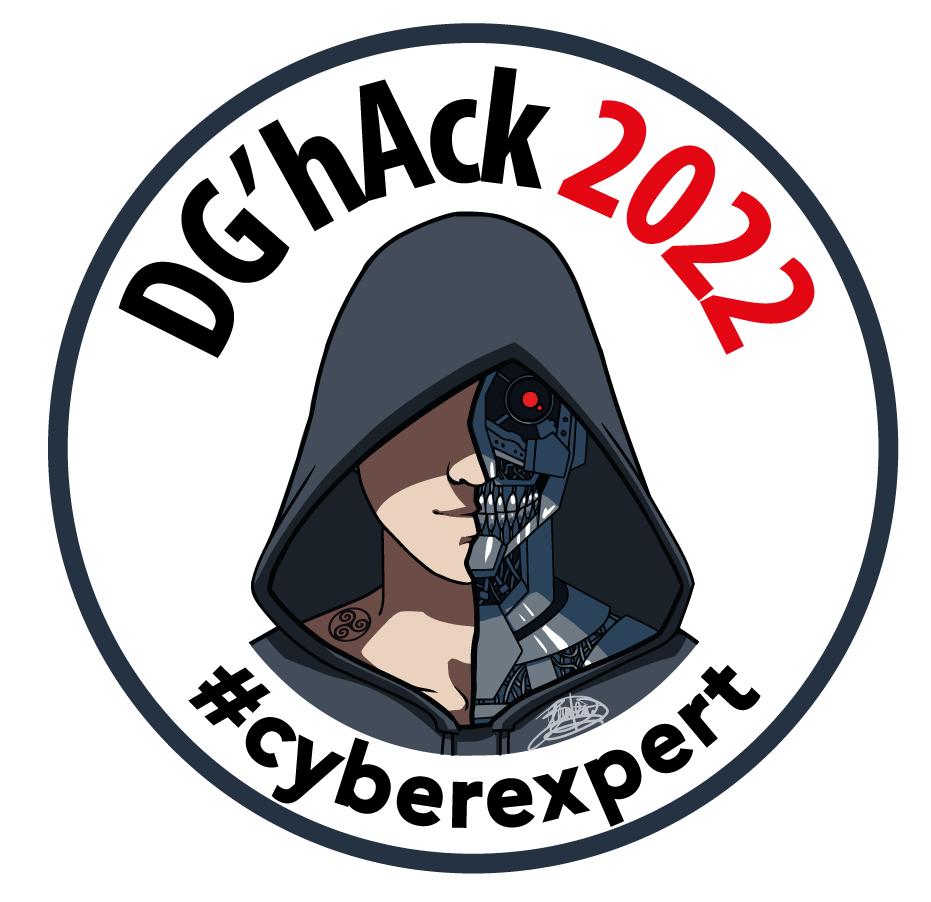

# WriteUp_DgHack_2022
WriteUp de quelques challenges du DG'Hack 2022

Cette année, avec le pseudo *Kaamos*, j'ai fini 10ème du classement étudiant et 39ème du classement général (sur 948 personnes) avec 600 points.

Voici quelques Writeups : 

1. Ne Jamais Renoncer (stéganographie / 50 points)
2. Vivre pas cher (forensics / 100 points)
3. Pas si Chronophage (dev / 100 points)

    

